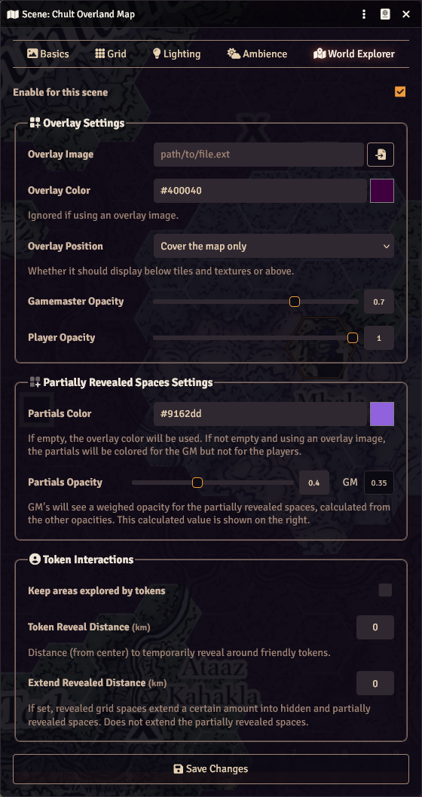
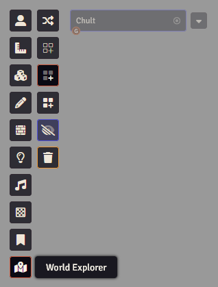
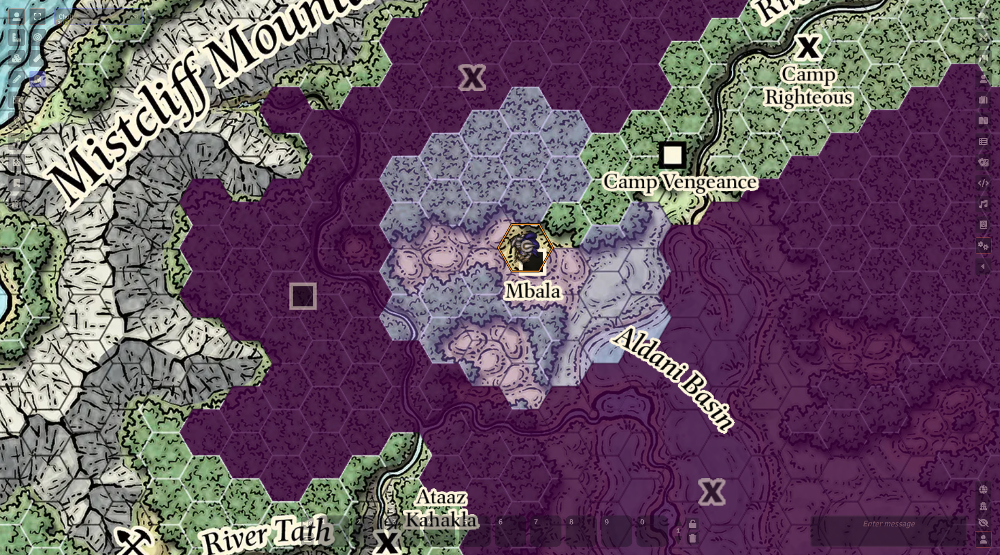

# World Explorer

GM tool for hexcrawl campaigns that allows displaying a second manual fog of war (with color or image) only over the background layer while keeping the grid visible. You can choose what else this layer covers or not: drawings, (overhead) tiles, and tokens. Grid spaces can be revealed or made partially visible. The GM can always do this manually, but you can also enable auto-revealing areas explored by friendly tokens.

If you're feeling generous, you can send something through [Paypal](https://paypal.me/carlosfernandez1779?locale.x=en_US) if you want.

## Features

### Scene Settings & Canvas Tools

 
 Scene setting tab (left) and  Canvas control tools (right)
 
 

Enable this module in scene settings. Once enabled, a tool button will be available in the canvas controls to the left. With those, you can either edit the map in toggle mode (where you hide/reveal grid spaces one at time) or in reveal, partial, or hide modes. The tools also allow you to quickly change the opacity for the GM and to reset the entire map (hiding or revealing everything).

### Separate Gamemaster and Player Opacities

 

Gamemaster view (left) and player view (right) of the scene with World Explorer enabled

By default, the GM has 70% opacity and players have 100% opacity. While the GM can see what's underneath, the view is completely blocked for players unless you set it otherwise. The GM can quickly change their own opacity from the canvas controls whenever they want.

### Partially Revealed Spaces

Optionally, you can mark spaces as being partially revealed using the World Explorer canvas tools to the left. These spaces have their own color and opacity that you can set (40% by default). You can use it, for example, to mark stuff on the map that players know about but haven't visited.

### Automatic Revealing

While the module expects a manual approach, you can optionally set the module to automatically reveal spaces that players have ventured through. It only performs these updates for tokens that have a player owner. Tokens used to represent wandering encounters won't get revealed to players.

&nbsp;

## Credits

* Thanks to [morepurplemorebetter](https://github.com/morepurplemorebetter/) for implementing partially revealed tiles as well as certain optimizations and fixes
